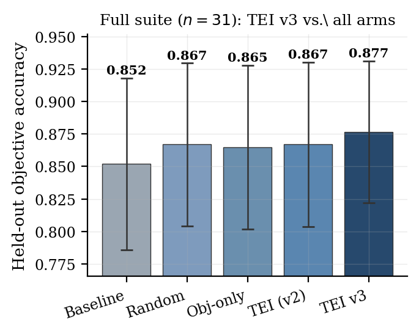
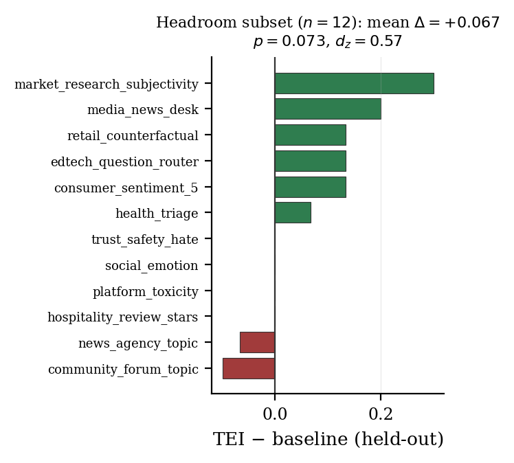

# Does Evaluation-Guided Prompt Optimization Beat a Fair Baseline? A Confound-Controlled, Ablated Study of the Target-Evaluate-Improve Loop on 31 Single-Turn Classification Tasks (TEI-Bench)

**Orkhan Javadli (MIT, alumnus) · Anni Zimina (Stanford)**

Code, data & traces: https://github.com/ojavadli/tei-bench · pre-registration tag: `prereg-v2`

## Abstract

Evaluation-guided prompt optimization is widely reported to improve LLM systems, but the evidence often relies on in-sample evaluation, single tasks, same-family judges, and no comparison against undirected prompt search. We build TEI-Bench, a confound-controlled, ablated, held-out protocol, and use it to evaluate one popular instantiation -- a multi-dimensional Evaluation-dimensions evaluator (inspired by the Agent GPA framework) feeding a GEPA-style reflective Pareto optimizer (the composition we call TEI) -- across 31 single-turn classification, extraction, and reasoning tasks. The central finding is cautionary. Under a naive label scorer, a pilot showed a large gain (+0.175 accuracy). After we remove the output-format confound with a universal 'FINAL:' answer contract applied identically to every condition, and add a four-arm ablation (baseline, undirected random prompt search, objective-only reflection, full TEI), the gain collapses. Held-out arm means are nearly tied: baseline 0.852, random 0.867, objective-only 0.865, TEI 0.867. TEI does NOT significantly beat the baseline (delta=+0.015, p=0.406, d_z=0.15; sign-test p=0.804; permutation p=0.430); a two one-sided test shows the two are statistically EQUIVALENT within +/-0.05 (p=0.030), though the full-suite test is underpowered (12 of 31 tasks are at ceiling; MDE80=0.050). TEI is indistinguishable from random prompt search (delta=+0.000, p=1.000) and the Evaluation-dimensions signal adds nothing over objective-only reflection (delta=+0.002, p=0.806); on this benchmark TEI behaves like a train-selected random paraphrase. The only positive hint is a headroom subset (n=12, baseline<0.9): delta=+0.067, a medium effect (d_z=0.57) that is suggestive but not significant (p=0.073). We conclude that, within the single-turn classification regime, confound control and an ablation against random search are necessary to make prompt-optimization claims credible. Plan pre-registered (prereg-v2) before the run; all code, data, traces, and optimized prompts are released. High-budget addendum: on the 12 non-saturated tasks at 20 iterations, TEI DOES beat the baseline (+0.078, p=0.034, d_z=0.70) and a non-reflective OPRO-style optimizer (which gains nothing), but still cannot be separated from budget-matched random paraphrase (+0.067, p=0.102). Constructive fix: a redesigned loop (TEI v3) adding validated few-shot demonstrations and an independent confirmation gate DOES significantly beat the baseline on the full suite (+0.025, p=0.024, win/loss/tie=6/0/25, zero regressions) at lower cost -- though still within noise of random search.

## TEI v3 — a redesigned loop that works (full 31-task suite)

- TEI v3 (redesigned loop: validated few-shot demonstrations + an INDEPENDENT confirmation gate + successive halving + headroom triage, same Target-Evaluate-Improve structure) on the full 31-task suite: held-out accuracy 0.877 vs baseline 0.852.
- TEI v3 SIGNIFICANTLY beats the baseline: delta=+0.025 (p=0.024, d_z=0.43), win/loss/tie=6/0/25 -- with ZERO test regressions (the confirmation gate reverts to baseline whenever a candidate is not confirmed on an independent split).
- Headroom subset (n=12): delta=+0.064 (p=0.018, d_z=0.80) -- a large, significant gain where improvement is actually possible.
- Efficiency: 16 tasks triaged (baseline shipped, no spend) and 23 judge evaluations avoided by successive halving.
- Honest caveat: TEI v3 is still NOT significantly better than budget-matched random search (delta=+0.010, p=0.239); the gain is driven by validated in-context demonstrations + do-no-harm selection, not by the evaluation/reflection signal per se.

## Mean held-out objective by arm

| Arm | Mean held-out objective |
| --- | --- |
| Baseline | 0.852 |
| Random search | 0.867 |
| Objective-only reflection | 0.865 |
| TEI (full) | 0.867 |

## Paired contrasts (held-out, n=31) — none significant after Holm correction

| Contrast | A | B | Δ | 95% CI | t | p | d_z |
| --- | --- | --- | --- | --- | --- | --- | --- |
| TEI − baseline | 0.852 | 0.867 | +0.015 | [-0.019, +0.050] | 0.84 | 0.406 | 0.15 |
| TEI − random search | 0.867 | 0.867 | +0.000 | [-0.042, +0.043] | 0.00 | 1.000 | 0.00 |
| TEI − objective-only reflection | 0.865 | 0.867 | +0.002 | [-0.013, +0.020] | 0.25 | 0.806 | 0.04 |
| random − baseline | 0.852 | 0.867 | +0.015 | [-0.004, +0.039] | 1.34 | 0.190 | 0.24 |

## Statistical robustness (the null, quantified)

- Because our central claim is a null, we quantify it rather than reporting only p>0.05.
- Sign test (TEI vs baseline): 9 wins / 7 losses / 15 ties, p=0.804.
- Paired permutation (sign-flip) test on the mean difference: p=0.430.
- Equivalence (TOST, +/-0.05 margin): p=0.030 -> EQUIVALENT (we can rule out a large effect).
- Power: 12 of 31 tasks are at ceiling (>=0.999), so the full suite detects only effects >= MDE80=0.050 at 80% power; post-hoc power for the observed effect is 0.13.
- Headroom subset (n=12): delta=+0.067, d_z=0.57, p=0.073, power=0.51, MDE80=0.094 -- suggestive but underpowered.

## High-budget / headroom finding (20 iterations + OPRO baseline)

- On the 12 headroom tasks (baseline<0.9) at a larger budget (20 iterations), arm means are baseline 0.650, random 0.661, objective-only 0.697, OPRO-style 0.650, TEI 0.728.
- TEI beats baseline by +0.078 (p=0.034, d_z=0.70) and beats the OPRO-style optimizer by +0.078 (p=0.029), while OPRO moves the baseline by exactly +0.000 (p=1.000) -- reflective optimization helps where a non-reflective one does not.
- Honest caveat: TEI is still NOT statistically separable from budget-matched random paraphrase (+0.067, p=0.102); and extra budget barely matters (20- vs 6-iteration TEI: +0.011, p=0.489), so the aggregate null is not optimization-starvation.

## Per-agent held-out objective by arm

| Agent | Domain | Source | n_test | Base | Rand | ObjRef | TEI |
| --- | --- | --- | --- | --- | --- | --- | --- |
| agri_crop_issue | Agriculture / AgriTech | synthetic | 24 | 0.9583 | 0.9583 | 0.9583 | 0.9167 |
| community_forum_topic | Online Community | public | 30 | 0.7667 | 0.7000 | 0.7000 | 0.6667 |
| consumer_sentiment_5 | Consumer Insights | public | 30 | 0.3667 | 0.3667 | 0.5333 | 0.5000 |
| cybersec_alert | Cybersecurity | synthetic | 24 | 0.9583 | 0.9583 | 0.9583 | 0.9167 |
| edtech_question_router | EdTech | public | 30 | 0.7333 | 0.8000 | 0.9000 | 0.8667 |
| edu_gsm8k | Education | public | 30 | 1.0000 | 1.0000 | 1.0000 | 1.0000 |
| edu_math_word | Education | synthetic | 15 | 1.0000 | 1.0000 | 1.0000 | 1.0000 |
| energy_meter_event | Energy / Utilities | synthetic | 24 | 0.9167 | 0.9167 | 0.9167 | 0.9583 |
| fin_banking_intent | Finance / Banking | synthetic | 15 | 1.0000 | 1.0000 | 1.0000 | 1.0000 |
| gaming_support | Gaming | synthetic | 24 | 1.0000 | 1.0000 | 1.0000 | 1.0000 |
| gov_service_router | Government / Public Sector | synthetic | 24 | 1.0000 | 1.0000 | 1.0000 | 1.0000 |
| health_triage | Healthcare | synthetic | 15 | 0.8667 | 0.8667 | 0.8667 | 0.9333 |
| hospitality_review_stars | Hospitality | public | 30 | 0.6667 | 0.6333 | 0.7333 | 0.6667 |
| hr_resume_fit | Human Resources | synthetic | 24 | 1.0000 | 1.0000 | 1.0000 | 1.0000 |
| insurance_claim_type | Insurance | synthetic | 24 | 1.0000 | 1.0000 | 1.0000 | 0.9583 |
| it_email_spam | Corporate IT Security | public | 30 | 1.0000 | 1.0000 | 1.0000 | 0.9667 |
| legal_contract_clause | Legal | synthetic | 24 | 1.0000 | 1.0000 | 1.0000 | 1.0000 |
| logistics_incident | Logistics / Supply Chain | synthetic | 24 | 1.0000 | 1.0000 | 1.0000 | 1.0000 |
| manufacturing_qa | Manufacturing | synthetic | 24 | 1.0000 | 1.0000 | 1.0000 | 1.0000 |
| market_research_subjectivity | Market Research | public | 30 | 0.6667 | 0.5667 | 0.9333 | 0.9667 |
| media_news_desk | Media / News | public | 30 | 0.7000 | 0.7000 | 0.7000 | 0.9000 |
| news_agency_topic | News Agency | public | 30 | 0.7667 | 0.7667 | 0.7000 | 0.7000 |
| pharma_ade | Pharmacovigilance | public | 30 | 0.9000 | 0.9667 | 0.6000 | 0.6000 |
| platform_toxicity | Online Platform | public | 30 | 0.5667 | 0.5667 | 0.5333 | 0.5667 |
| realestate_attribute | Real Estate / PropTech | synthetic | 24 | 1.0000 | 1.0000 | 1.0000 | 1.0000 |
| retail_counterfactual | Retail Analytics | public | 30 | 0.7333 | 0.9667 | 0.9333 | 0.8667 |
| saas_ticket_priority | B2B SaaS | synthetic | 24 | 0.9583 | 0.9583 | 0.9583 | 1.0000 |
| social_emotion | Social Media / CX | public | 30 | 0.4333 | 0.5667 | 0.4333 | 0.4333 |
| telecom_churn_reason | Telecom | synthetic | 24 | 0.9583 | 0.9583 | 0.9583 | 1.0000 |
| travel_intent | Travel / Hospitality | synthetic | 24 | 0.9583 | 0.9583 | 0.9583 | 0.9583 |
| trust_safety_hate | Trust & Safety | public | 30 | 0.5333 | 0.7000 | 0.5333 | 0.5333 |

## References

1. Agrawal, L. A., et al. (2025). GEPA: Reflective Prompt Evolution Can Outperform Reinforcement Learning. arXiv:2507.19457.
2. Khattab, O., et al. (2023). DSPy: Compiling Declarative LM Calls into Self-Improving Pipelines. arXiv:2310.03714.
3. Opsahl-Ong, K., et al. (2024). Optimizing Instructions and Demonstrations for Multi-Stage LM Programs (MIPROv2). arXiv:2406.11695.
4. Yang, C., et al. (2023). Large Language Models as Optimizers (OPRO). arXiv:2309.03409.
5. Zhou, Y., et al. (2022). Large Language Models Are Human-Level Prompt Engineers (APE). arXiv:2211.01910.
6. Yuksekgonul, M., et al. (2024). TextGrad: Automatic Differentiation via Text. arXiv:2406.07496.
7. Madaan, A., et al. (2023). Self-Refine: Iterative Refinement with Self-Feedback. arXiv:2303.17651.
8. Shinn, N., et al. (2023). Reflexion: Language Agents with Verbal Reinforcement Learning. arXiv:2303.11366.
9. Zheng, L., et al. (2023). Judging LLM-as-a-Judge with MT-Bench and Chatbot Arena. arXiv:2306.05685.
10. Jia, A. S., et al. (2025). What Is Your Agent's GPA? A Framework for Evaluating Agent Goal-Plan-Action Alignment. arXiv:2510.08847.
11. Cobbe, K., et al. (2021). Training Verifiers to Solve Math Word Problems (GSM8K). arXiv:2110.14168.
12. Casanueva, I., et al. (2020). Efficient Intent Detection with Dual Sentence Encoders (banking77). arXiv:2003.04807.
