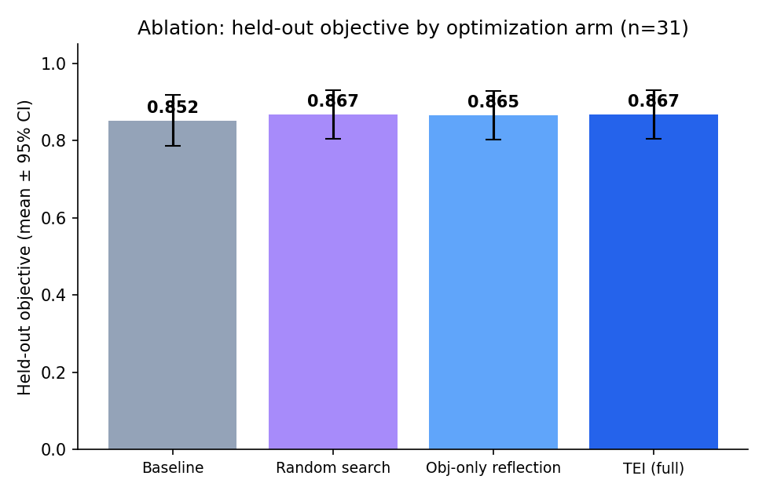
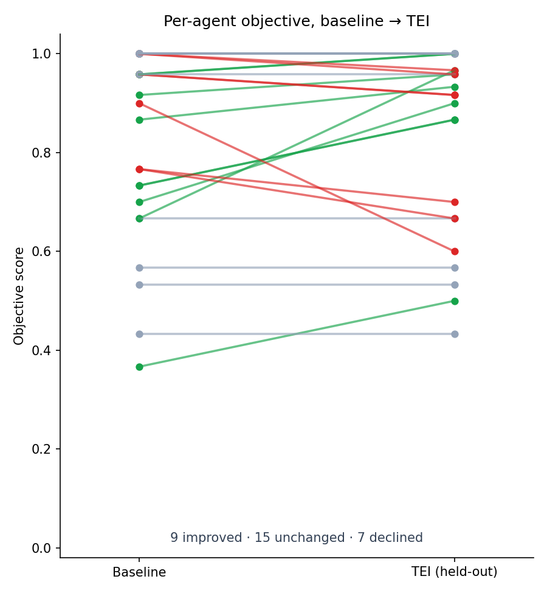
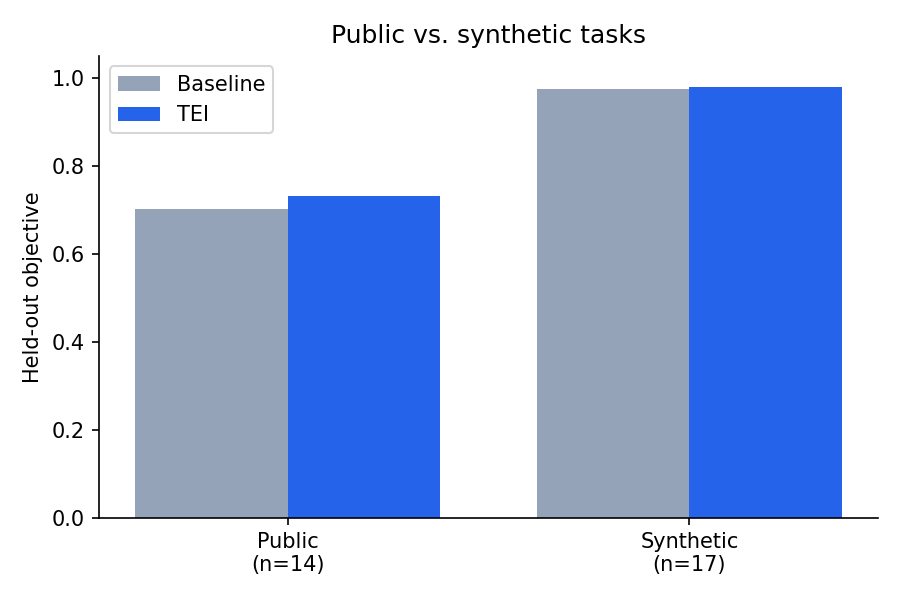

# When Prompt Optimization Doesn't: A Controlled, Ablated, Held-Out Evaluation of Evaluation-Guided Prompt Optimization Across 31 Tasks (TEI-Bench)

**Orkhan Javadli (MIT, alumnus) · Anni Zimina (Stanford)**

Code, data & traces: https://github.com/ojavadli/tei-bench · pre-registration tag: `prereg-v2`

## Abstract

Evaluation-guided prompt optimization is widely reported to improve LLM systems, but the evidence often relies on in-sample evaluation, single tasks, same-family judges, and no comparison against undirected prompt search. We build TEI-Bench, a controlled, ablated, held-out protocol, and use it to evaluate one popular instantiation -- a GPA-inspired evaluator feeding a GEPA-style reflective Pareto optimizer (the composition we call TEI) -- across 31 single-turn tasks. The central finding is cautionary. Under a naive label scorer, a pilot showed a large gain (+0.175 accuracy). After we remove the output-format confound with a universal 'FINAL:' answer contract applied identically to every condition, and add a four-arm ablation (baseline, undirected random prompt search, objective-only reflection, full TEI), the gain collapses. Held-out arm means are nearly tied: baseline 0.852, random 0.867, objective-only 0.865, TEI 0.867. TEI does NOT significantly beat the baseline (delta=+0.015, p=0.406, d_z=0.15), is statistically indistinguishable from random prompt search (delta=+0.000, p=1.000), and shows no benefit from the GPA signal over objective-only reflection (delta=+0.002, p=0.806). Only a small, marginal gain appears on the headroom subset (delta=+0.067, p=0.073). We conclude that for single-turn classification with a competent baseline, the marginal value of evaluation-guided prompt optimization is unproven and easily overstated by naive scoring. Plan pre-registered (prereg-v2) before the run; all code, data, traces, and optimized prompts are released.

## Mean held-out objective by arm

| Arm | Mean held-out objective |
| --- | --- |
| Baseline | 0.852 |
| Random search | 0.867 |
| Objective-only reflection | 0.865 |
| TEI (full) | 0.867 |

## Paired contrasts (held-out, n=31) — none significant after Holm correction

| Contrast | A | B | Δ | 95% CI | t | p | d_z |
| --- | --- | --- | --- | --- | --- | --- | --- |
| TEI − baseline | 0.852 | 0.867 | +0.015 | [-0.019, +0.050] | 0.84 | 0.406 | 0.15 |
| TEI − random search | 0.867 | 0.867 | +0.000 | [-0.042, +0.043] | 0.00 | 1.000 | 0.00 |
| TEI − objective-only reflection | 0.865 | 0.867 | +0.002 | [-0.013, +0.020] | 0.25 | 0.806 | 0.04 |
| random − baseline | 0.852 | 0.867 | +0.015 | [-0.004, +0.039] | 1.34 | 0.190 | 0.24 |

## Per-agent held-out objective by arm

| Agent | Domain | Source | n_test | Base | Rand | ObjRef | TEI |
| --- | --- | --- | --- | --- | --- | --- | --- |
| agri_crop_issue | Agriculture / AgriTech | synthetic | 24 | 0.9583 | 0.9583 | 0.9583 | 0.9167 |
| community_forum_topic | Online Community | public | 30 | 0.7667 | 0.7000 | 0.7000 | 0.6667 |
| consumer_sentiment_5 | Consumer Insights | public | 30 | 0.3667 | 0.3667 | 0.5333 | 0.5000 |
| cybersec_alert | Cybersecurity | synthetic | 24 | 0.9583 | 0.9583 | 0.9583 | 0.9167 |
| edtech_question_router | EdTech | public | 30 | 0.7333 | 0.8000 | 0.9000 | 0.8667 |
| edu_gsm8k | Education | public | 30 | 1.0000 | 1.0000 | 1.0000 | 1.0000 |
| edu_math_word | Education | synthetic | 15 | 1.0000 | 1.0000 | 1.0000 | 1.0000 |
| energy_meter_event | Energy / Utilities | synthetic | 24 | 0.9167 | 0.9167 | 0.9167 | 0.9583 |
| fin_banking_intent | Finance / Banking | synthetic | 15 | 1.0000 | 1.0000 | 1.0000 | 1.0000 |
| gaming_support | Gaming | synthetic | 24 | 1.0000 | 1.0000 | 1.0000 | 1.0000 |
| gov_service_router | Government / Public Sector | synthetic | 24 | 1.0000 | 1.0000 | 1.0000 | 1.0000 |
| health_triage | Healthcare | synthetic | 15 | 0.8667 | 0.8667 | 0.8667 | 0.9333 |
| hospitality_review_stars | Hospitality | public | 30 | 0.6667 | 0.6333 | 0.7333 | 0.6667 |
| hr_resume_fit | Human Resources | synthetic | 24 | 1.0000 | 1.0000 | 1.0000 | 1.0000 |
| insurance_claim_type | Insurance | synthetic | 24 | 1.0000 | 1.0000 | 1.0000 | 0.9583 |
| it_email_spam | Corporate IT Security | public | 30 | 1.0000 | 1.0000 | 1.0000 | 0.9667 |
| legal_contract_clause | Legal | synthetic | 24 | 1.0000 | 1.0000 | 1.0000 | 1.0000 |
| logistics_incident | Logistics / Supply Chain | synthetic | 24 | 1.0000 | 1.0000 | 1.0000 | 1.0000 |
| manufacturing_qa | Manufacturing | synthetic | 24 | 1.0000 | 1.0000 | 1.0000 | 1.0000 |
| market_research_subjectivity | Market Research | public | 30 | 0.6667 | 0.5667 | 0.9333 | 0.9667 |
| media_news_desk | Media / News | public | 30 | 0.7000 | 0.7000 | 0.7000 | 0.9000 |
| news_agency_topic | News Agency | public | 30 | 0.7667 | 0.7667 | 0.7000 | 0.7000 |
| pharma_ade | Pharmacovigilance | public | 30 | 0.9000 | 0.9667 | 0.6000 | 0.6000 |
| platform_toxicity | Online Platform | public | 30 | 0.5667 | 0.5667 | 0.5333 | 0.5667 |
| realestate_attribute | Real Estate / PropTech | synthetic | 24 | 1.0000 | 1.0000 | 1.0000 | 1.0000 |
| retail_counterfactual | Retail Analytics | public | 30 | 0.7333 | 0.9667 | 0.9333 | 0.8667 |
| saas_ticket_priority | B2B SaaS | synthetic | 24 | 0.9583 | 0.9583 | 0.9583 | 1.0000 |
| social_emotion | Social Media / CX | public | 30 | 0.4333 | 0.5667 | 0.4333 | 0.4333 |
| telecom_churn_reason | Telecom | synthetic | 24 | 0.9583 | 0.9583 | 0.9583 | 1.0000 |
| travel_intent | Travel / Hospitality | synthetic | 24 | 0.9583 | 0.9583 | 0.9583 | 0.9583 |
| trust_safety_hate | Trust & Safety | public | 30 | 0.5333 | 0.7000 | 0.5333 | 0.5333 |

## References

1. Agrawal, L. A., et al. (2025). GEPA: Reflective Prompt Evolution Can Outperform Reinforcement Learning. arXiv:2507.19457.
2. Khattab, O., et al. (2023). DSPy: Compiling Declarative LM Calls into Self-Improving Pipelines. arXiv:2310.03714.
3. Opsahl-Ong, K., et al. (2024). Optimizing Instructions and Demonstrations for Multi-Stage LM Programs (MIPROv2). arXiv:2406.11695.
4. Yang, C., et al. (2023). Large Language Models as Optimizers (OPRO). arXiv:2309.03409.
5. Zhou, Y., et al. (2022). Large Language Models Are Human-Level Prompt Engineers (APE). arXiv:2211.01910.
6. Yuksekgonul, M., et al. (2024). TextGrad: Automatic Differentiation via Text. arXiv:2406.07496.
7. Madaan, A., et al. (2023). Self-Refine: Iterative Refinement with Self-Feedback. arXiv:2303.17651.
8. Shinn, N., et al. (2023). Reflexion: Language Agents with Verbal Reinforcement Learning. arXiv:2303.11366.
9. Zheng, L., et al. (2023). Judging LLM-as-a-Judge with MT-Bench and Chatbot Arena. arXiv:2306.05685.
10. Jia, A. S., et al. (2025). What Is Your Agent's GPA? A Framework for Evaluating Agent Goal-Plan-Action Alignment. arXiv:2510.08847.
11. Cobbe, K., et al. (2021). Training Verifiers to Solve Math Word Problems (GSM8K). arXiv:2110.14168.
12. Casanueva, I., et al. (2020). Efficient Intent Detection with Dual Sentence Encoders (banking77). arXiv:2003.04807.
