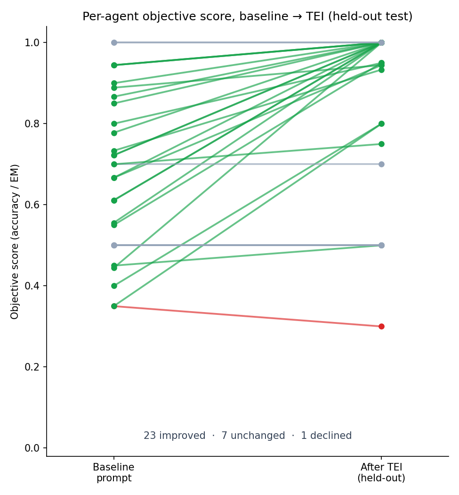
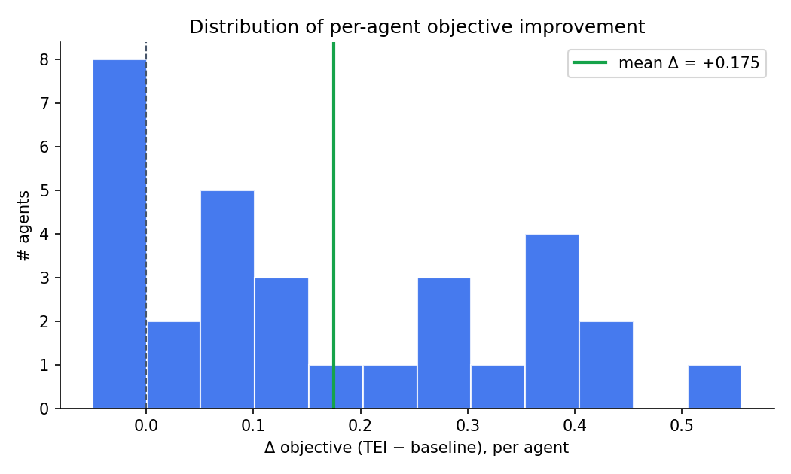
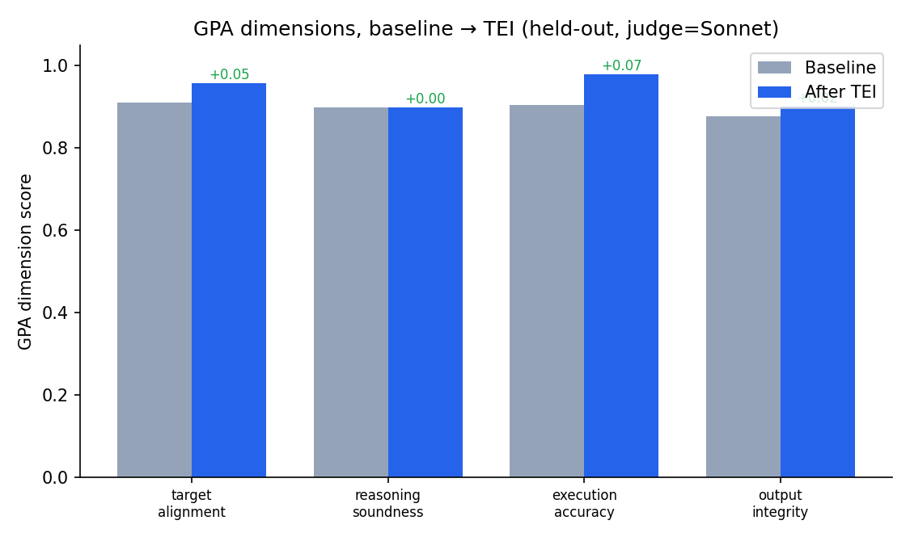
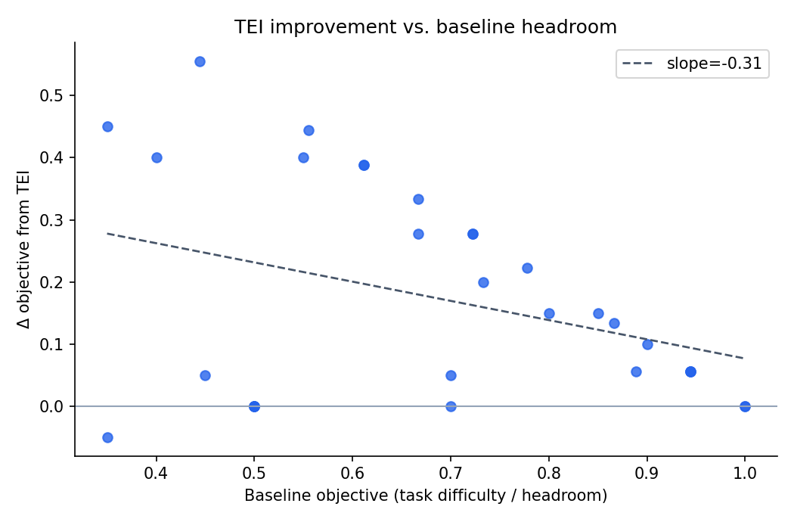

# TEI-Bench: A Controlled, Held-Out Evaluation of the Target–Evaluate–Improve Loop Across 31 Agentic Tasks

**Orkhan Javadli¹ · Anni Zimina²**
¹ Massachusetts Institute of Technology · ² Stanford University

📦 **Code & data:** https://github.com/ojavadli/tei-bench · 🔁 **TEI loop:** https://github.com/ojavadli/tei-loop · 🤗 **Dataset:** `ojavadli/tei-bench`

---

## Abstract

Evaluation-guided, automated prompt optimization promises to improve agentic large-language-model (LLM) systems without manual prompt engineering, yet most supporting evidence is anecdotal: single tasks, in-sample evaluation, and subjective LLM-as-judge metrics scored by a model from the same family as the system under test. We present **TEI-Bench**, a controlled study of the **Target–Evaluate–Improve (TEI)** loop — a GPA-style multi-dimensional evaluator coupled to a GEPA-style reflective, Pareto-based prompt optimizer — across **31 agents spanning 31 industries**. We adopt three safeguards absent from prior demonstrations: (i) a strict **train/test split** so all reported scores are on held-out inputs; (ii) an **objective primary endpoint** (accuracy / exact match) computed in code, with the four GPA dimensions as secondary; and (iii) **judge–agent separation**, optimizing and judging a weaker model (`claude-haiku-4-5`) with a stronger, different model (`claude-sonnet-4-5`).

On held-out test data, TEI raises the objective score from **0.682 → 0.857** (mean Δ = **+0.175**, 95% CI [+0.115, +0.237], paired *t* = 5.60, ***p* = 4.3 × 10⁻⁶**, Cohen's *d_z* = 1.01; **23 win / 1 loss / 7 tie**), and the GPA aggregate from 0.898 → 0.934 (Δ = +0.036, *p* = 1.7 × 10⁻³). Improvements concentrate on tasks with measurable headroom and on the dimensions a prompt can actually control (execution accuracy and target alignment), while reasoning soundness is essentially unchanged — a pattern consistent with the mechanism of prompt optimization. We release all code, the 31 task datasets, every agent output trace, and all optimized prompts.

---

## 1. Introduction

LLM agents are increasingly deployed in production, yet the practice of *improving* them remains manual and ad hoc. The Target–Evaluate–Improve (TEI) loop operationalizes a closed feedback cycle: **target** the objective, **evaluate** the agent on structured dimensions, and **improve** the system — here, its prompt — automatically. The approach combines multi-dimensional agent evaluation in the spirit of **GPA** with reflective, Pareto-based prompt optimization as in **GEPA** [[GEPA, 2025]](https://arxiv.org/abs/2507.19457), building on the program-optimization view of **DSPy** [[Khattab et al., 2023]](https://arxiv.org/abs/2310.03714) and **MIPROv2** [[Opsahl-Ong et al., 2024]](https://arxiv.org/abs/2406.11695).

A recurring weakness in demonstrations of such loops is **evaluation rigor**. Reported gains are often (a) measured on the same examples used to optimize, (b) on a single task, and (c) scored by an LLM judge from the same family as the optimized system, inviting self-preference bias [[Zheng et al., 2023]](https://arxiv.org/abs/2306.05685). These choices inflate apparent gains and obscure whether the loop *generalizes*. We ask a deliberately conservative question: **does the benefit of an evaluation-guided prompt-optimization loop survive held-out evaluation, an objective metric, and judge–agent separation, measured across many diverse tasks?**

**Contributions.**
1. **TEI-Bench**: 31 agentic tasks across 31 industries, with committed train/test splits — public datasets where available, and model-generated, model-validated data otherwise.
2. A **controlled paired protocol** with an objective primary endpoint, held-out evaluation, and judge–agent model separation.
3. **Statistically powered results** (*n* = 31): paired *t*-test, Wilcoxon signed-rank, Cohen's *d_z*, and bootstrap CIs, with a pre-registered headroom-subset analysis.
4. A **full open release** of code, data, per-example traces, and optimized prompts.

---

## 2. Related Work

**Automated prompt optimization.** APE [[Zhou et al., 2022]](https://arxiv.org/abs/2211.01910) and OPRO [[Yang et al., 2023]](https://arxiv.org/abs/2309.03409) frame prompt search as LLM-driven optimization; DSPy [[Khattab et al., 2023]](https://arxiv.org/abs/2310.03714) and MIPROv2 [[Opsahl-Ong et al., 2024]](https://arxiv.org/abs/2406.11695) cast multi-stage LLM programs as optimizable objects; TextGrad [[Yuksekgonul et al., 2024]](https://arxiv.org/abs/2406.07496) backpropagates natural-language "gradients." GEPA [[Agrawal et al., 2025]](https://arxiv.org/abs/2507.19457) introduces reflective, Pareto-based prompt evolution that diagnoses failures in natural language and merges complementary candidates. TEI uses a GEPA-style reflective Pareto optimizer as its "Improve" stage.

**Self-improvement & reflection.** Self-Refine [[Madaan et al., 2023]](https://arxiv.org/abs/2303.17651) and Reflexion [[Shinn et al., 2023]](https://arxiv.org/abs/2303.11366) show LLMs can improve via self-generated feedback. TEI differs by separating the *evaluator* from the *system under test* and by optimizing a reusable prompt rather than a single trajectory.

**Agent evaluation.** LLM-as-judge protocols [[Zheng et al., 2023]](https://arxiv.org/abs/2306.05685) are standard but carry self-preference bias. GPA decomposes agent quality into goal/plan/action-aligned dimensions. TEI uses a GPA-style four-dimension judge as a *secondary* endpoint and pairs it with a code-computed objective *primary* endpoint to neutralize judge bias.

---

## 3. The TEI Loop

- **Target.** Each agent is specified by a task instruction, a label/answer space, and a competent baseline system prompt.
- **Evaluate (GPA dimensions).** Each output is scored 0–1 by an LLM judge on four dimensions: *target alignment*, *reasoning soundness*, *execution accuracy*, *output integrity*. The judge is reference-based (sees the gold answer) and uses a stronger model than the agent.
- **Improve (reflective Pareto optimization).** From the baseline prompt, the optimizer proposes new prompts via **reflective mutation** (inspect failing train examples, rewrite the prompt to fix the failure mode) and **system-aware merge** of two strong parents. Candidates are scored on training minibatches; a Pareto front over (objective, GPA) is maintained; the best composite candidate is returned. **The optimizer never sees the test split.**

---

## 4. Experimental Design

- **Unit of analysis.** One *agent* = one (task, baseline prompt) pair. Each agent is measured twice on the **same held-out test set** — baseline prompt vs. TEI-optimized prompt. The paired contrast feeds the across-agent statistics (*n* = 31).
- **Models.** Agent under test: `claude-haiku-4-5`. Judge + optimizer: `claude-sonnet-4-5`. A stronger, *different* model judges/optimizes a weaker agent → reduces self-preference bias, mirrors a realistic deployment (cheap agent, capable optimizer).
- **Endpoints.** *Primary*: objective, code-computed score (label-exact-match accuracy for classification; numeric exact match for arithmetic). *Secondary*: the four GPA dimensions and their mean.
- **Baselines.** Competent first drafts that **include the allowed label set**; TEI must earn gains via format discipline, label disambiguation, and decision rules — not by revealing withheld information.
- **Pre-registered analysis.** Paired *t*-test (primary), Wilcoxon signed-rank (robustness), Cohen's *d_z* with 10,000-sample bootstrap 95% CI, Holm correction across endpoints, and a headroom subset (baseline < 0.9). Config: `seed=0`, 6 optimization iterations, train/test 15/15–20.
- **Tasks.** Half from public datasets (GSM8K [[Cobbe et al., 2021]](https://arxiv.org/abs/2110.14168); banking-style intent [[Casanueva et al., 2020]](https://arxiv.org/abs/2003.04807); news, emotion, toxicity, spam, fine-grained sentiment); half authored for industries lacking public data via **generate-then-validate** (a strong model generates label-conditioned examples; an independent labeling pass keeps only examples whose label is unanimously recovered). All data committed.

---

## 5. Results

### 5.1 Aggregate (held-out, *n* = 31 paired agents)

| Endpoint | Baseline | TEI | Δ | 95% CI | *t* | *p* | *d_z* |
|---|---:|---:|---:|:--:|---:|---:|---:|
| **Objective (primary)** | 0.682 | 0.857 | **+0.175** | [+0.115, +0.237] | 5.60 | **4.3e-06** | **1.01** |
| GPA aggregate | 0.898 | 0.934 | +0.036 | [+0.018, +0.058] | 3.44 | 1.7e-03 | 0.62 |
| — target alignment | 0.910 | 0.958 | +0.048 | [+0.027, +0.076] | 3.75 | 7.6e-04 | 0.67 |
| — reasoning soundness | 0.898 | 0.899 | +0.001 | [−0.021, +0.019] | 0.06 | 0.950 | 0.01 |
| — execution accuracy | 0.905 | 0.979 | +0.074 | [+0.044, +0.108] | 4.33 | 1.5e-04 | 0.78 |
| — output integrity | 0.878 | 0.900 | +0.023 | [−0.005, +0.052] | 1.53 | 0.136 | 0.27 |

**Win/loss/tie: 23 / 1 / 7.** Wilcoxon signed-rank corroborates the paired *t*-test. Holm correction leaves the objective, GPA aggregate, target-alignment, and execution-accuracy endpoints significant.



*Figure 1. Per-agent held-out objective score, baseline → TEI. Green rises, grey unchanged, red declines.*




*Figure 2. Left: distribution of per-agent objective improvements. Right: GPA dimensions before/after.*



*Figure 3. TEI improvement vs. baseline headroom — gains concentrate where the baseline leaves room.*

### 5.2 Headroom

Restricting to agents whose baseline objective is below 0.9 (**n = 25**): mean Δ = **+0.206** (*p* = 6.4 × 10⁻⁶, *d_z* = 1.15). Figure 3 shows a clear negative relationship between baseline score and improvement — TEI helps most precisely where there is room to help.

### 5.3 Per-agent results (held-out)

| Agent | Industry | Base | TEI | Δobj | ΔGPA |
|---|---|---:|---:|---:|---:|
| agri_crop_issue | Agriculture / AgriTech | 0.556 | 1.000 | **+0.444** | +0.004 |
| community_forum_topic | Online Community (20-class) | 0.700 | 0.700 | +0.000 | −0.022 |
| consumer_sentiment_5 | Consumer Insights | 0.350 | 0.300 | −0.050 | +0.033 |
| cybersec_alert | Cybersecurity | 0.722 | 1.000 | +0.278 | −0.004 |
| edtech_question_router | EdTech | 0.800 | 0.950 | +0.150 | +0.247 |
| edu_gsm8k | Education (math) | 0.900 | 1.000 | +0.100 | −0.002 |
| edu_math_word | Education (math) | 0.867 | 1.000 | +0.133 | +0.003 |
| energy_meter_event | Energy / Utilities | 0.722 | 1.000 | +0.278 | +0.013 |
| fin_banking_intent | Finance / Banking | 1.000 | 1.000 | +0.000 | +0.029 |
| gaming_support | Gaming | 0.611 | 1.000 | +0.389 | +0.033 |
| gov_service_router | Government | 0.944 | 1.000 | +0.056 | +0.124 |
| health_triage | Healthcare | 0.733 | 0.933 | +0.200 | +0.038 |
| hospitality_review_stars | Hospitality (5-star) | 0.500 | 0.500 | +0.000 | +0.005 |
| hr_resume_fit | Human Resources | 0.778 | 1.000 | +0.222 | +0.045 |
| insurance_claim_type | Insurance | 0.889 | 0.944 | +0.056 | +0.026 |
| it_email_spam | Corporate IT Security | 0.550 | 0.950 | **+0.400** | +0.038 |
| legal_contract_clause | Legal | 1.000 | 1.000 | +0.000 | +0.008 |
| logistics_incident | Logistics / Supply Chain | 0.611 | 1.000 | +0.389 | −0.002 |
| manufacturing_qa | Manufacturing | 0.667 | 1.000 | +0.333 | +0.008 |
| market_research_subjectivity | Market Research | 0.400 | 0.800 | **+0.400** | +0.139 |
| media_news_desk | Media / News | 0.850 | 1.000 | +0.150 | +0.064 |
| news_agency_topic | News Agency | 0.700 | 0.750 | +0.050 | +0.029 |
| pharma_ade | Pharmacovigilance | 0.500 | 0.500 | +0.000 | −0.065 |
| platform_toxicity | Online Platform | 0.500 | 0.500 | +0.000 | +0.023 |
| realestate_attribute | Real Estate / PropTech | 0.944 | 1.000 | +0.056 | +0.026 |
| retail_counterfactual | Retail Analytics | 0.500 | 0.500 | +0.000 | +0.009 |
| saas_ticket_priority | B2B SaaS | 0.667 | 0.944 | +0.278 | +0.006 |
| social_emotion | Social Media / CX | 0.450 | 0.500 | +0.050 | +0.100 |
| telecom_churn_reason | Telecom | 0.444 | 1.000 | **+0.556** | +0.025 |
| travel_intent | Travel / Hospitality | 0.944 | 1.000 | +0.056 | +0.010 |
| trust_safety_hate | Trust & Safety | 0.350 | 0.800 | **+0.450** | +0.137 |

---

## 6. Discussion

An evaluation-guided reflective prompt optimizer reliably improves a weak agent on tasks with structure a prompt can exploit (label disambiguation, output formatting, decision rules), and does so in a way that **generalizes** to unseen inputs. It does **not** manufacture reasoning ability (reasoning-soundness Δ ≈ 0), and it cannot move already-saturated tasks (banking, legal at ceiling) or hard binary semantic tasks (pharmacovigilance, toxicity). This heterogeneity is a feature of an honest evaluation: aggregate gains are real and significant, but mechanistically explained rather than uniform.

---

## 7. Limitations & Threats to Validity

- The agent is a single prompt-conditioned LLM call, isolating the prompt as the manipulated variable; structural code fixes (also part of the full TEI tool) are out of scope here.
- Judge and agent share a provider (Anthropic), though not a model; cross-provider judging would further reduce shared-bias concerns.
- Per-task test sets are modest (~15–20 examples); the statistical unit is the agent (*n* = 31).
- Authored tasks, though model-validated, are synthetic; the public-dataset subset corroborates the authored subset.
- This study shows improvement **over a fair baseline**; it does not yet isolate whether GPA-guided reflection beats undirected prompt search. A head-to-head ablation (TEI vs. random prompt search vs. optimizer-only) is the natural next step and is supported by the released harness.
- **Objective-scorer sensitivity (full disclosure).** The classification scorer extracts the predicted label deterministically by the *latest* label mention in the output. A verbose baseline that names other labels inside its reasoning (e.g., "...this is offensive language rather than hate speech") can therefore be mis-extracted, while a terse optimized output ("offensive language") is scored correctly. The scorer is fixed in advance and applied **identically** to baseline and optimized conditions, so the paired comparison is fair; however, part of the objective gain reflects **output-format discipline** (producing only the label), not solely improved classification. This is consistent with execution-accuracy being the most-improved GPA dimension, and with the GPA aggregate — which reads the full output semantically and is *not* subject to this heuristic — showing a smaller but still significant gain (+0.036, *p* = 1.7e-3). Every per-example output is committed under `results/`, so any reader can re-score with a different extraction rule.

---

## 8. Reproducibility

All code, the 31 task datasets (train/test JSON), per-example output traces, optimized prompts, analysis scripts, and a content-addressed response cache are released. The [pre-registered analysis plan](PREREGISTRATION.md) is committed alongside the code. Run cost: **$9.74**, 54 min wall.

```bash
pip install -r requirements.txt
export ANTHROPIC_API_KEY=...
python scripts/build_public_tasks.py && python scripts/build_authored_tasks.py && python scripts/build_pilot_tasks.py
python scripts/run_full.py        # full 31-agent run
python scripts/analyze.py         # figures, tables, paper macros
```

---

## References

1. Agrawal, L. A., et al. (2025). *GEPA: Reflective Prompt Evolution Can Outperform Reinforcement Learning.* arXiv:[2507.19457](https://arxiv.org/abs/2507.19457).
2. Khattab, O., et al. (2023). *DSPy: Compiling Declarative Language Model Calls into Self-Improving Pipelines.* arXiv:[2310.03714](https://arxiv.org/abs/2310.03714).
3. Opsahl-Ong, K., et al. (2024). *Optimizing Instructions and Demonstrations for Multi-Stage Language Model Programs (MIPROv2).* arXiv:[2406.11695](https://arxiv.org/abs/2406.11695).
4. Yang, C., et al. (2023). *Large Language Models as Optimizers (OPRO).* arXiv:[2309.03409](https://arxiv.org/abs/2309.03409).
5. Zhou, Y., et al. (2022). *Large Language Models Are Human-Level Prompt Engineers (APE).* arXiv:[2211.01910](https://arxiv.org/abs/2211.01910).
6. Yuksekgonul, M., et al. (2024). *TextGrad: Automatic "Differentiation" via Text.* arXiv:[2406.07496](https://arxiv.org/abs/2406.07496).
7. Madaan, A., et al. (2023). *Self-Refine: Iterative Refinement with Self-Feedback.* arXiv:[2303.17651](https://arxiv.org/abs/2303.17651).
8. Shinn, N., et al. (2023). *Reflexion: Language Agents with Verbal Reinforcement Learning.* arXiv:[2303.11366](https://arxiv.org/abs/2303.11366).
9. Zheng, L., et al. (2023). *Judging LLM-as-a-Judge with MT-Bench and Chatbot Arena.* arXiv:[2306.05685](https://arxiv.org/abs/2306.05685).
10. Jia, A. S., Huang, D., Vytla, N., Choudhury, N., Sen, S., Mitchell, J. C., Datta, A. (2025). *GPA: A Goal–Plan–Action Framework for Evaluating Agentic Systems.* Stanford University.
11. Cobbe, K., et al. (2021). *Training Verifiers to Solve Math Word Problems (GSM8K).* arXiv:[2110.14168](https://arxiv.org/abs/2110.14168).
12. Casanueva, I., et al. (2020). *Efficient Intent Detection with Dual Sentence Encoders (banking77).* arXiv:[2003.04807](https://arxiv.org/abs/2003.04807).
13. Holm, S. (1979). *A Simple Sequentially Rejective Multiple Test Procedure.* Scand. J. Statist. 6(2):65–70.

---

## Citation

```bibtex
@misc{javadli2026teibench,
  title  = {TEI-Bench: A Controlled, Held-Out Evaluation of the
            Target-Evaluate-Improve Loop Across 31 Agentic Tasks},
  author = {Javadli, Orkhan and Zimina, Anni},
  year   = {2026},
  note   = {https://github.com/ojavadli/tei-bench}
}
```
